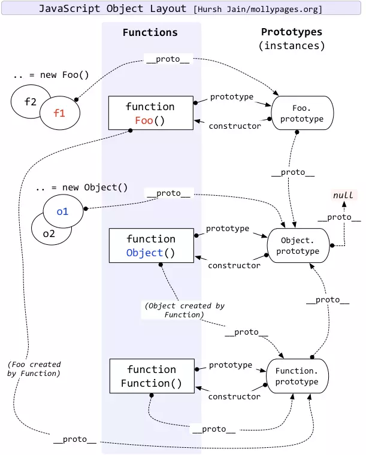

# 类和继承

## 类

+ es6

  + ```javascript
    class Animal {
      type = '哺乳类' // 声dd明到实例上的
      constructor() {
        this.type = '哺乳类'
      }
    
      get a() { // Object.defineProperty(Animal.protoype,a)
        return 1 // Animal.prototype.a = 1;
      }
    
      say() { // 放到了原型上 // Animal.prototype.say
        console.log(this)
      }
    
      // 静态属性就是定义到类上的属性 es6中只有静态方法
      static get flag() { // es6的静态属性
        return '动物'
      }
    }
    
    let animal = new Animal() // 如果将类中的方法拿出来用必须绑定this 否则默认指向undefind
    console.log(Animal.flag)
    // let say = animal.say() // error Uncaught TypeError: say is not a function
    let say = animal.say.bind(animal)
    say()
    ```

+ es5

  + ```javascript
    function Animal(){
        this.type = '哺乳类' // 实例上的属性
    }
    Animal.prototype.say = function(){ // 原型上的方法
        console.log('我是动物')
    }
    ```
## 继承

+ 

+ es6

  + ```javascript
    class Tiger extends Animal {
      constructor(name) {
    super(name) // 调用super Animal.call(tiger,name);
        // super 指代的是父类
        // constructor中的super指代的问题
        console.log(this)
      }
    
      static getAnimal() {
        console.log(super.flag) // 这个super指代的是父类
      }
    
      say() {
        super.say() // super 指向的是 父类的原型
      }
    }
    
    let tiger = new Tiger('老虎')
    tiger.say() // say
    console.log(Tiger.getAnimal()); // 1
    ```
    
  
+ es5

  + ```javascript
    function Animal(){
        this.type = '哺乳类'
    }
    Animal.prototype.say = function(){
        console.log('我是动物')
    }
    function Tiger(name){
        this.name = name;
         // 调用父类的构造函数 并且让this指向子类即可 这一步可让tiger调用this.type
        Animal.call(this);
    }
    // create 实现了原型链的继承 和 constructor 的指向
    function create(parentProto){
        function Fn(){}
        Fn.prototype = parentProto;
        let fn = new Fn();
        fn.constructor = Tiger
        return fn;
    }
    Tiger.prototype = create(Animal.prototype)
    // create 方法可以直接使用Object.create实现
    // Tiger.prototype = Object.create(Animal.prototype,{constructor:{value:Tiger}});
    let tiger = new Tiger('大老虎');
    console.log(tiger.type) // 哺乳类
    tiger.say() // 我是动物
    console.log(tiger.constructor); // [Function: Tiger]
    ```

  
